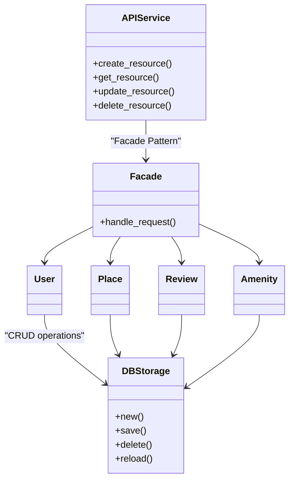

```mermaid
classDiagram
    %% === Presentation Layer ===
    class APIService {
        +create_resource()
        +get_resource()
        +update_resource()
        +delete_resource()
    }

    %% === Business Logic Layer ===
    class Facade {
        +handle_request()
    }

    class User
    class Place
    class Review
    class Amenity

    %% === Persistence Layer ===
    class DBStorage {
        +new()
        +save()
        +delete()
        +reload()
    }

    %% Relationships
    APIService --> Facade : "Facade Pattern"
    Facade --> User
    Facade --> Place
    Facade --> Review
    Facade --> Amenity
    User --> DBStorage : "CRUD operations"
    Place --> DBStorage
    Review --> DBStorage
    Amenity --> DBStorage
```
